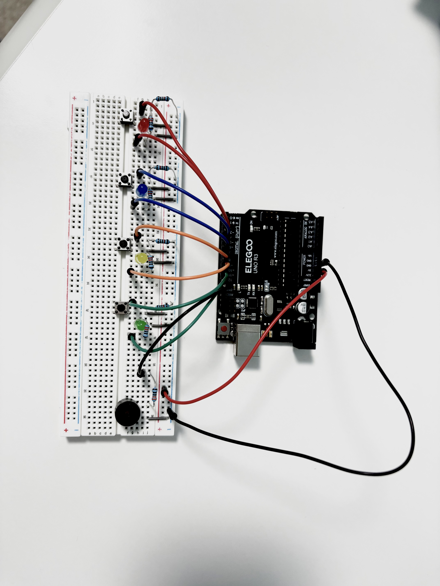

# LED Reaction Time Tester

A 4-button reflex tester built with an Arduino UNO. One of four LEDs 
lights up at random and the goal is to press ong the matching button 
as fast as possible. The same LED never repeats twice in a row, so 
there's no pattern to memorize. Reaction time gets logged in milliseconds,
with a running best time tracked across the session.

A correct press triggers a quick beep and prints the time, plus a callout if it's
a new record. A wrong press sets off a longer buzz, resets the round, and adds a short 
pause before the next LED lights. Small penalty, but enough to keep the pressure on.

## Components

- Arduino UNO R3
- 4x LED
- 4x push button
- 4x 220Ω resistor (LEDs)
- 4x 10kΩ resistor (pull-down buttons)
- 1x buzzer
- Breadboard and jumper wires

## How It Works

Powering on starts the game immediately. A random LED lights and a timer 
begins the instant it does. Pressing the button underneath that LED stops 
the clock and logs the time to Serial Monitor. Wrong button, and the buzzer 
sounds off before the game resets and moves to a new light.

Button state runs through plain pull-down resistors rather than the Arduino's built-in pull-ups, 
because that's what ended up working reliably on the breadboard after some troubleshooting.

## Circuit

## Demo

**Circuit and button presses:**

https://github.com/user-attachments/assets/demo_circuit.mp4

**Serial Monitor output:**

https://github.com/user-attachments/assets/demo_serial.mp4

## Code

See [`reflex_tester.ino`](reflex_tester.ino)

## What's Next

- LCD display, so the score shows up without needing Serial Monitor open
- Round counter / session average

## License

MIT
